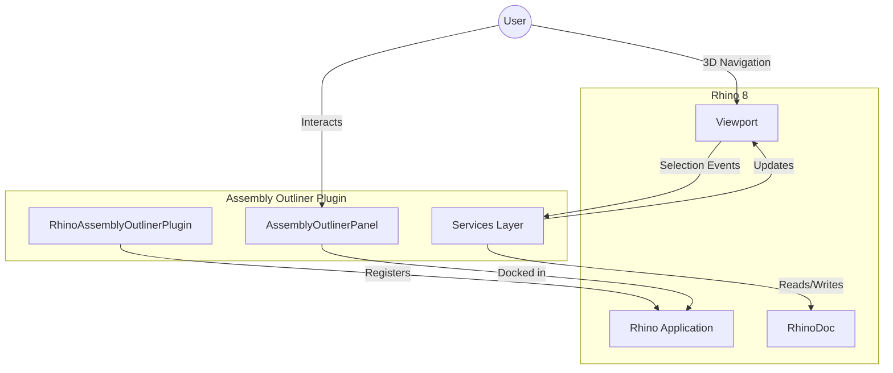
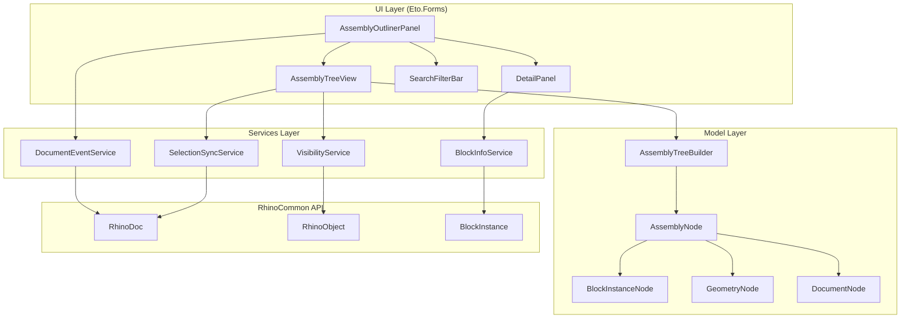
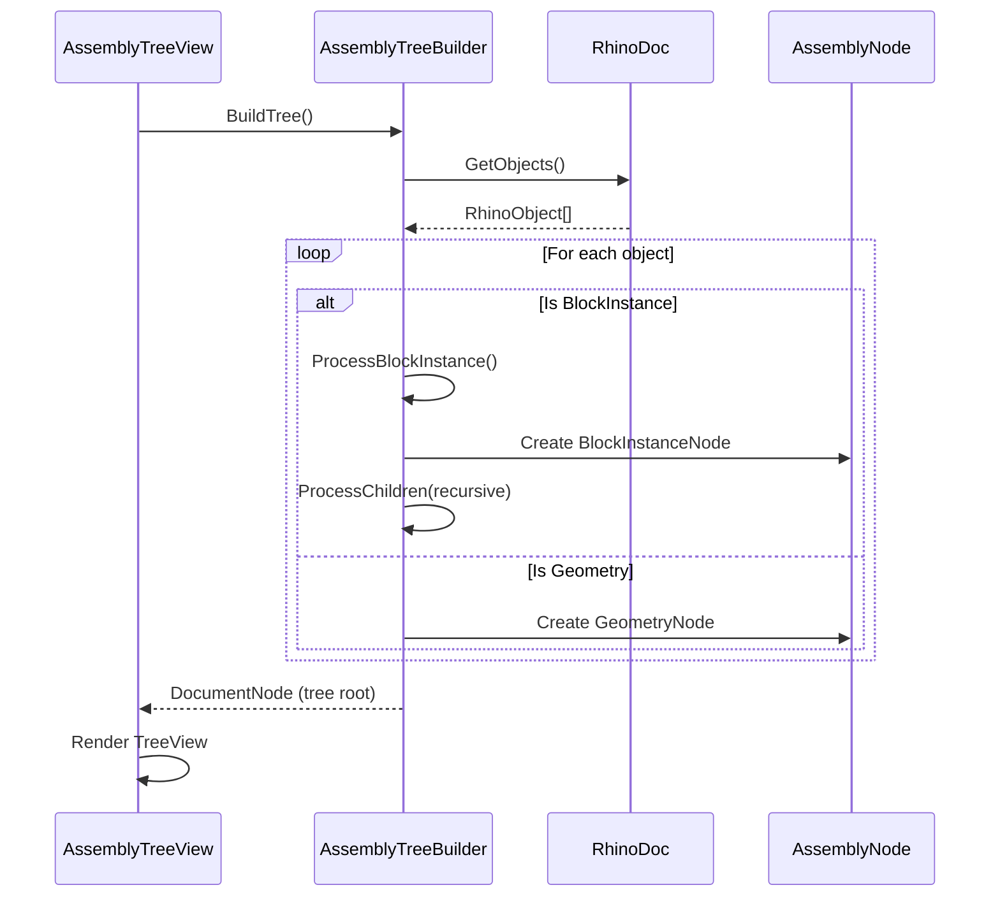
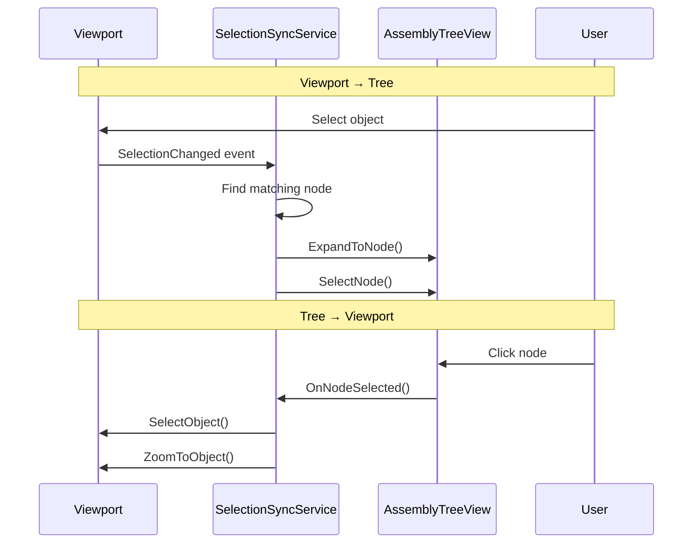
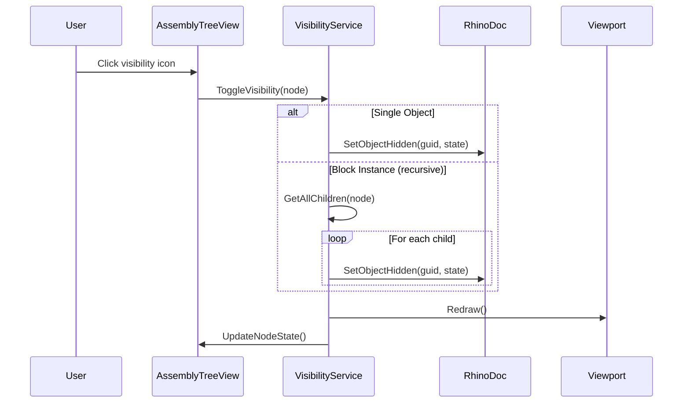
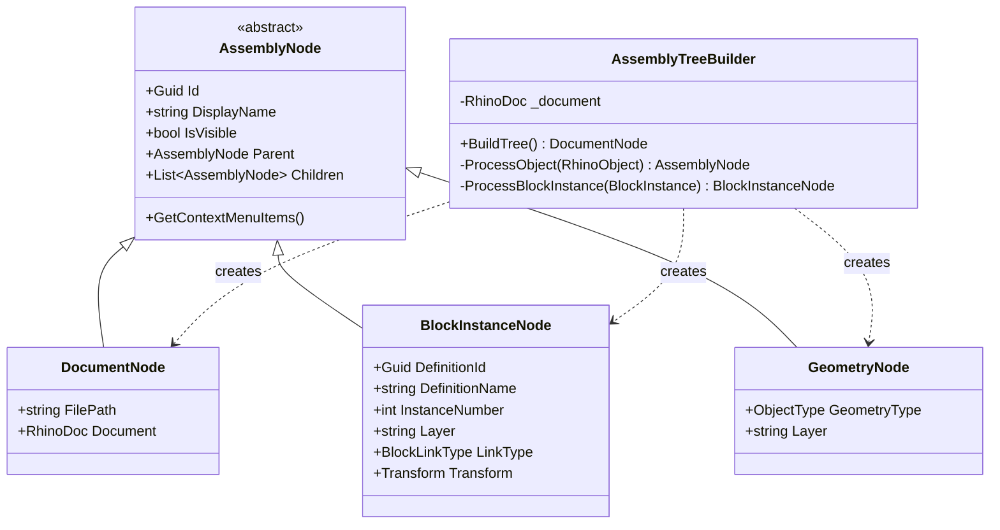
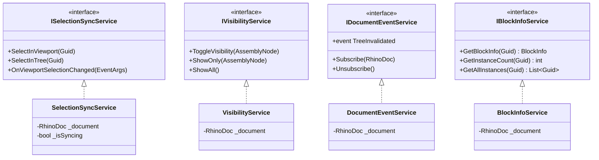
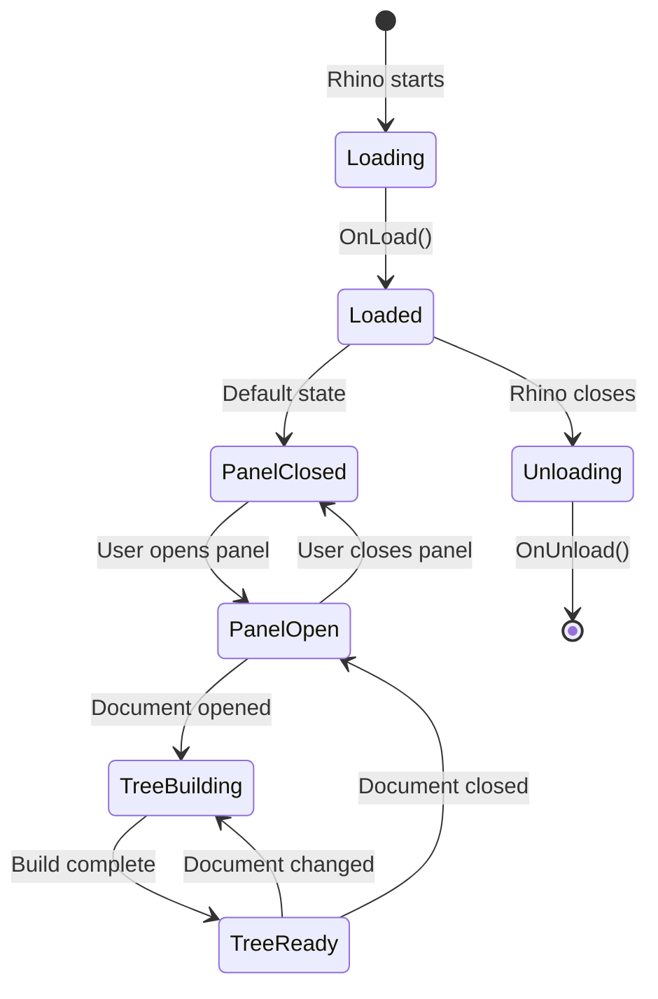

# Architecture Overview

This document describes the high-level architecture of the Rhino Assembly Outliner plugin.

## System Context

## Component Architecture

## Data Flow

### Tree Building

### Bidirectional Selection Sync

### Visibility Toggle

## Class Diagram

## Services

## Plugin Lifecycle

## Key Design Decisions

### 1. Eto.Forms for UI
- Cross-platform compatibility (Windows/Mac)
- Native Rhino integration
- Consistent look with Rhino panels

### 2. Service Layer Pattern
- Separates UI from business logic
- Easier testing and maintenance
- Clear responsibilities

### 3. Recursive Tree Building
- Handles arbitrary nesting depth
- Lazy loading for performance (future)
- Mirrors actual document structure

### 4. Event-Driven Sync
- Responds to Rhino document events
- Bidirectional selection sync
- Minimal polling

## Performance Considerations

- **Large Documents**: Implement virtual scrolling for 1000+ nodes
- **Deep Nesting**: Consider lazy loading child nodes
- **Frequent Updates**: Debounce document change events
- **Selection Sync**: Use flags to prevent circular updates

## Future Extensions

- BOM (Bill of Materials) export
- Custom node icons per block type
- Saved tree configurations
- Grasshopper integration (read-only)
